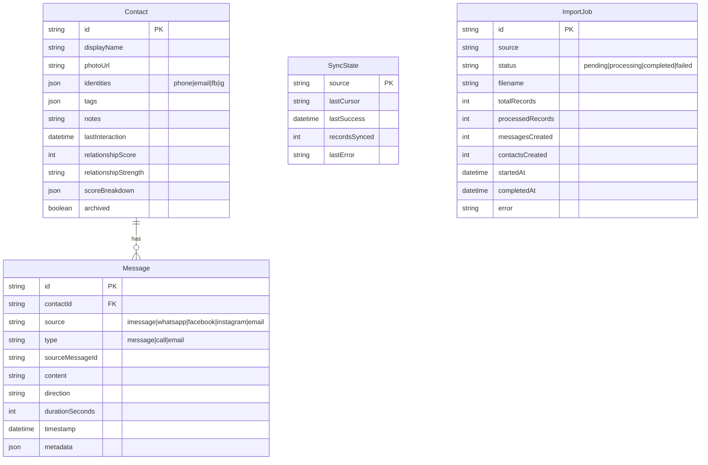

# feat: Multi-Source Data Integrations

**Created:** 2026-01-29
**Deepened:** 2026-01-29
**Type:** Enhancement
**Status:** Ready for Implementation

## Research Insights Summary

This plan has been enhanced with findings from 7 parallel research agents:

### Key Improvements from Research

1. **File Upload Security** (Security Sentinel): Must validate magic bytes, prevent path traversal, use UUID filenames
2. **Streaming JSON** (Performance Oracle): Use `stream-json` for FB/IG to avoid OOM on large files
3. **Batch DB Operations** (Framework Docs): Batch `updateLastInteraction` calls - currently N+1 pattern
4. **Prisma/SQLite** (Framework Docs): `skipDuplicates` not supported, use manual dedup or raw `INSERT OR IGNORE`
5. **WhatsApp Parsing** (Best Practices): Use `{ daysFirst: true/false }` option for locale handling
6. **SSE Throttling** (Performance Oracle): Report progress every 100 items, not every message
7. **Type Safety** (TypeScript Review): Add Zod schemas for external JSON validation

## Overview

Add integrations to import contacts and messages from multiple data sources beyond iMessage:
- **macOS Contacts** - Enrich existing contacts with names from the system address book
- **WhatsApp** - Import chat exports (.txt/.zip files)
- **Gmail** - Import emails via Google Takeout MBOX files
- **Facebook Messenger** - Import message history from JSON exports
- **Instagram DMs** - Import direct messages from JSON exports

## Problem Statement

The Personal CRM currently only syncs data from iMessage. Users communicate across multiple platforms, and without importing data from WhatsApp, Gmail, Facebook, and Instagram, they have an incomplete view of their relationships. Additionally, many contacts appear as phone numbers or emails instead of names because the system doesn't leverage the macOS Contacts database.

## Proposed Solution

Build a file-upload-based import system for WhatsApp, Gmail, Facebook, and Instagram using the existing connector architecture. Enhance the macOS Contacts integration to enrich contact display names.

### Architecture Overview

```
┌─────────────────────────────────────────────────────────────┐
│                    Import Flow                               │
├─────────────────────────────────────────────────────────────┤
│  1. User uploads export file (WhatsApp/Gmail/FB/IG)         │
│  2. API route receives file, streams to temp storage        │
│  3. Parser processes file format (txt/mbox/json)            │
│  4. Connector yields RawMessage/RawContact objects          │
│  5. Deduplication service matches/creates contacts          │
│  6. Messages batch-inserted via createMessages()            │
│  7. Progress reported via Server-Sent Events                │
└─────────────────────────────────────────────────────────────┘
```

## Technical Approach

### Phase 1: Foundation & macOS Contacts Enhancement

#### 1.1 Update Schema Types
- [x] Add "instagram" to `DataSourceType` in `src/lib/connectors/types.ts`
- [x] Add "instagram" to `MessageSource` in `src/schemas/message.schema.ts`
- [x] Add "instagram" to identity source in `src/schemas/contact.schema.ts`

#### 1.2 Enhance macOS Contacts Sync
- [ ] Update `syncContactNames()` in `src/actions/sync.actions.ts` to be more robust
- [ ] Add progress tracking for contact name resolution
- [ ] Handle edge cases (contacts with multiple phone numbers/emails)

**Reference:** `src/lib/connectors/contacts/reader.ts:1-89`

### Phase 2: File Upload Infrastructure

#### 2.1 Upload API Route
- [x] Create `src/app/api/import/route.ts` for file uploads
- [x] Implement streaming file handling for large exports (100MB+)
- [x] Add file validation (type, size limits)
- [x] Store uploaded files temporarily in scratchpad directory

```typescript
// src/app/api/import/route.ts
export async function POST(request: Request) {
  const formData = await request.formData();
  const file = formData.get('file') as File;
  const source = formData.get('source') as string;

  // Validate file type based on source
  // Stream to temp storage
  // Return import job ID
}
```

#### 2.2 Progress Reporting via SSE
- [ ] Create `src/app/api/import/[jobId]/progress/route.ts` for SSE
- [ ] Implement progress tracking in import jobs
- [ ] Send periodic updates (messages processed, contacts created)

```typescript
// src/app/api/import/[jobId]/progress/route.ts
export async function GET(request: Request, { params }: { params: { jobId: string } }) {
  const encoder = new TextEncoder();
  const stream = new ReadableStream({
    async start(controller) {
      // Poll job status and send updates
    }
  });

  return new Response(stream, {
    headers: {
      'Content-Type': 'text/event-stream',
      'Cache-Control': 'no-cache',
      'Connection': 'keep-alive',
    },
  });
}
```

#### 2.3 Import UI Component
- [x] Create `src/components/import/import-dialog.tsx`
- [x] Add drag-and-drop file upload
- [x] Show real-time progress with SSE
- [x] Display import summary on completion

### Phase 3: WhatsApp Connector

#### 3.1 WhatsApp Parser
- [x] Create `src/lib/connectors/whatsapp/parser.ts`
- [x] Use `whatsapp-chat-parser` npm package for .txt parsing
- [ ] Handle ZIP archives containing multiple chat exports
- [x] Normalize participant identifiers (phone numbers)

```typescript
// src/lib/connectors/whatsapp/parser.ts
import { parseString } from 'whatsapp-chat-parser';

export async function* parseWhatsAppExport(
  content: string,
  filename: string
): AsyncGenerator<RawMessage> {
  const messages = await parseString(content);

  for (const msg of messages) {
    yield {
      sourceId: `wa-${filename}-${msg.date.getTime()}`,
      type: 'message',
      content: msg.message,
      direction: isOutbound(msg.author) ? 'outbound' : 'inbound',
      timestamp: msg.date,
      senderIdentifier: normalizePhone(msg.author),
      metadata: { chatName: filename }
    };
  }
}
```

#### 3.2 WhatsApp Connector
- [x] Create `src/lib/connectors/whatsapp/connector.ts`
- [x] Extend `BaseConnector` following iMessage pattern
- [x] Register with `registerConnector('whatsapp', ...)`

**Reference:** `src/lib/connectors/imessage/connector.ts:1-50`

### Phase 4: Gmail Connector

#### 4.1 Gmail MBOX Parser
- [ ] Create `src/lib/connectors/gmail/parser.ts`
- [ ] Use `node-mbox` for MBOX parsing
- [ ] Use `mailparser` for individual email parsing
- [ ] Extract sender, recipients, subject, body, date

```typescript
// src/lib/connectors/gmail/parser.ts
import { Mbox } from 'node-mbox';
import { simpleParser } from 'mailparser';

export async function* parseGmailMbox(
  filePath: string
): AsyncGenerator<RawMessage> {
  const mbox = new Mbox(filePath);

  for await (const buffer of mbox) {
    const email = await simpleParser(buffer);

    yield {
      sourceId: email.messageId || `gmail-${email.date?.getTime()}`,
      type: 'email',
      content: email.text || email.subject,
      direction: isFromMe(email.from) ? 'outbound' : 'inbound',
      timestamp: email.date || new Date(),
      senderIdentifier: extractEmail(email.from),
      metadata: {
        subject: email.subject,
        to: email.to,
        cc: email.cc,
      }
    };
  }
}
```

#### 4.2 Gmail Connector
- [ ] Create `src/lib/connectors/gmail/connector.ts`
- [ ] Handle large MBOX files with streaming
- [ ] Skip duplicate emails by Message-ID

### Phase 5: Facebook Messenger Connector

#### 5.1 Meta Encoding Fix Utility
- [x] Create `src/lib/connectors/meta/encoding.ts`
- [x] Fix UTF-8 mojibake in Facebook/Instagram exports

```typescript
// src/lib/connectors/meta/encoding.ts
export function fixMetaEncoding(text: string): string {
  try {
    // Facebook exports UTF-8 text encoded as Latin-1
    const bytes = new Uint8Array([...text].map(c => c.charCodeAt(0)));
    return new TextDecoder('utf-8').decode(bytes);
  } catch {
    return text;
  }
}
```

#### 5.2 Facebook Parser
- [x] Create `src/lib/connectors/facebook/parser.ts`
- [x] Parse `messages/inbox/*/message_*.json` structure
- [x] Handle photos, videos, reactions, stickers
- [x] Extract participant names (note: no phone/email available)

```typescript
// src/lib/connectors/facebook/parser.ts
interface FBMessage {
  sender_name: string;
  timestamp_ms: number;
  content?: string;
  photos?: Array<{ uri: string }>;
  reactions?: Array<{ reaction: string; actor: string }>;
}

export async function* parseFacebookExport(
  jsonPath: string
): AsyncGenerator<RawMessage> {
  const data = JSON.parse(await fs.readFile(jsonPath, 'utf-8'));

  for (const msg of data.messages) {
    yield {
      sourceId: `fb-${msg.timestamp_ms}`,
      type: 'message',
      content: msg.content ? fixMetaEncoding(msg.content) : null,
      direction: isFromMe(msg.sender_name) ? 'outbound' : 'inbound',
      timestamp: new Date(msg.timestamp_ms),
      senderIdentifier: `fb:${fixMetaEncoding(msg.sender_name)}`,
      metadata: {
        hasPhotos: !!msg.photos?.length,
        reactions: msg.reactions,
      }
    };
  }
}
```

#### 5.3 Facebook Connector
- [x] Create `src/lib/connectors/facebook/connector.ts`
- [ ] Handle ZIP archive extraction
- [x] Process multiple conversation folders

### Phase 6: Instagram DMs Connector

#### 6.1 Instagram Parser
- [x] Create `src/lib/connectors/instagram/parser.ts`
- [x] Parse `messages/inbox/*/message_*.json` (similar to Facebook)
- [x] Apply same encoding fix as Facebook
- [x] Handle Instagram-specific fields (likes, shares)

```typescript
// src/lib/connectors/instagram/parser.ts
export async function* parseInstagramExport(
  jsonPath: string
): AsyncGenerator<RawMessage> {
  const data = JSON.parse(await fs.readFile(jsonPath, 'utf-8'));

  for (const msg of data.messages) {
    yield {
      sourceId: `ig-${msg.timestamp_ms}`,
      type: 'message',
      content: msg.content ? fixMetaEncoding(msg.content) : null,
      direction: isFromMe(msg.sender_name) ? 'outbound' : 'inbound',
      timestamp: new Date(msg.timestamp_ms),
      senderIdentifier: `ig:${fixMetaEncoding(msg.sender_name)}`,
      metadata: {
        isLiked: msg.is_geoblocked_for_viewer,
        share: msg.share,
      }
    };
  }
}
```

#### 6.2 Instagram Connector
- [x] Create `src/lib/connectors/instagram/connector.ts`
- [x] Register with `registerConnector('instagram', ...)`

### Phase 7: Contact Matching Enhancement

#### 7.1 Name-Based Matching for FB/IG
- [ ] Update `src/lib/services/deduplication-service.ts`
- [ ] Add fuzzy name matching for Facebook/Instagram contacts
- [ ] Create `fb:name` and `ig:name` identity types
- [ ] Allow manual contact merge UI (future enhancement)

```typescript
// Enhanced identity matching
export async function findOrCreateContact(
  raw: RawContact,
  source: DataSourceType
): Promise<string> {
  // First try exact identifier match (phone, email)
  // Then try name-based match for FB/IG sources
  // Finally create new contact
}
```

### Phase 8: Import Dashboard Integration

#### 8.1 Settings/Import Page
- [ ] Create `src/app/settings/import/page.tsx`
- [ ] Add cards for each import source
- [ ] Show import history and status
- [ ] Link to export instructions for each platform

#### 8.2 Dashboard Integration
- [x] Add "Import Data" button to dashboard actions
- [ ] Show import status in sync status section
- [ ] Display source breakdown in stats

## Acceptance Criteria

### Functional Requirements
- [ ] macOS Contacts names are synced to display names
- [ ] WhatsApp .txt and .zip exports can be imported
- [ ] Gmail MBOX files can be imported
- [ ] Facebook Messenger JSON exports can be imported
- [ ] Instagram DM JSON exports can be imported
- [ ] Progress is shown during import
- [ ] Duplicate messages are not created on re-import
- [ ] Contacts are deduplicated across sources

### Non-Functional Requirements
- [ ] Handle files up to 500MB without memory issues
- [ ] Import 100k messages in under 5 minutes
- [ ] Graceful error handling with partial import recovery

### Quality Gates
- [ ] All existing tests pass
- [ ] New connectors have unit tests
- [ ] Import UI is responsive and accessible
- [ ] No console errors during import flow

## Dependencies & Prerequisites

- `whatsapp-chat-parser` - WhatsApp .txt parsing
- `node-mbox` - MBOX file parsing
- `mailparser` - Email parsing
- `yauzl` - Streaming ZIP extraction (memory-efficient)
- `stream-json` - Streaming JSON parsing for large FB/IG exports
- `file-type` - Magic byte validation for uploaded files
- `zod` - Runtime type validation for external JSON

## Risk Analysis & Mitigation

| Risk | Likelihood | Impact | Mitigation |
|------|------------|--------|------------|
| WhatsApp date format varies by locale | High | Medium | Test with multiple locale exports |
| Large files cause memory issues | Medium | High | Use streaming throughout |
| Facebook/Instagram encoding breaks | Low | Medium | Fallback to original text |
| Contact matching creates duplicates | Medium | Medium | Add manual merge UI later |

## References & Research

### Internal References
- Connector architecture: `src/lib/connectors/base-connector.ts`
- iMessage connector (reference): `src/lib/connectors/imessage/connector.ts`
- macOS Contacts reader: `src/lib/connectors/contacts/reader.ts`
- Deduplication service: `src/lib/services/deduplication-service.ts`
- Message service: `src/lib/services/message-service.ts`
- Sync actions: `src/actions/sync.actions.ts`

### External References
- WhatsApp chat parser: https://github.com/nicosommi/whatsapp-chat-parser
- node-mbox: https://github.com/robertklep/node-mbox
- mailparser: https://nodemailer.com/extras/mailparser/
- Facebook data export format: https://www.facebook.com/help/212802592074644
- Instagram data export: https://help.instagram.com/181231772500920

### Export Instructions for Users
- **WhatsApp**: Settings > Chats > Export Chat > Without Media
- **Gmail**: Google Takeout > Select Gmail > MBOX format
- **Facebook**: Settings > Your Facebook Information > Download Your Information > Messages (JSON)
- **Instagram**: Settings > Privacy and Security > Data Download > Request Download

## ERD Changes



## Implementation Phases Summary

| Phase | Description | Effort |
|-------|-------------|--------|
| 1 | Schema updates & macOS Contacts enhancement | Small |
| 2 | File upload infrastructure & SSE | Medium |
| 3 | WhatsApp connector | Medium |
| 4 | Gmail connector | Medium |
| 5 | Facebook Messenger connector | Medium |
| 6 | Instagram DMs connector | Small |
| 7 | Contact matching enhancement | Medium |
| 8 | Import dashboard integration | Medium |
