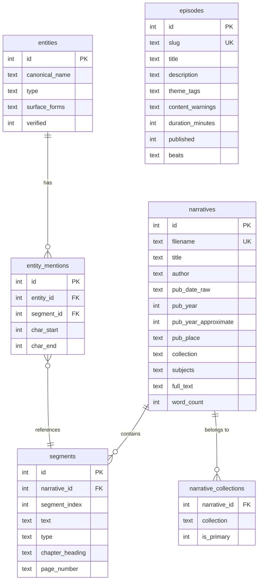

# feat: Human Lives — Interactive Episodes from DocSouth Slave Narratives

## Enhancement Summary

**Deepened on:** 2026-02-16
**Sections enhanced:** All major sections
**Review agents used:** architecture-strategist, performance-oracle, security-sentinel, code-simplicity-reviewer, kieran-typescript-reviewer, data-integrity-guardian, pattern-recognition-specialist, frontend-design-researcher

### Key Improvements
1. Schema hardened: UNIQUE constraints, typed enums, entity dedup fix, updated_at trigger, foreign_keys pragma
2. Security: FTS5 query sanitization, admin middleware, security headers, XSS prevention via safe rendering
3. Performance: Actual corpus is ~105K segments (not 50K), cheerio `{ xml: true }` mode, FTS bulk rebuild strategy, virtualized reader
4. TypeScript: Centralized `db-types.ts` with row/domain type separation, Zod validation for beats, `queries/` data access layer
5. Frontend: react-scrollama for scroll detection, Libre Baskerville font, trauma-informed content warnings, `<blockquote>` semantics, next/og for quote cards
6. Data integrity: Idempotent ingestion, UNIQUE on (narrative_id, segment_index), collection membership tracking

### Critical Timeline Note
Black History Month 2026 is NOW. The simplicity reviewer recommends focusing on Milestones 0-5 as the core ship target, with Milestones 6-8 as post-launch enhancements. Entity extraction (Milestone 3) can be deferred — episodes work without NER.

---

## Overview

Build an interactive web app that helps educators teach firsthand slave narratives through curated "episodes" — guided, scroll-driven storytelling experiences built from primary source excerpts. The app presents enslaved people as fully human (family, skills, intelligence, humor, community, love, faith, agency), not as one-dimensional victims.

**Target:** Functional prototype shareable during Black History Month 2026.

**Primary user:** Educators (HS + college) who need engaging primary-source materials.
**Secondary user:** Students consuming episodes independently.

## Core Principles (Non-Negotiable)

1. **Primary source first** — every quote links to exact source text location
2. **Clear separation** — primary text vs. app commentary visually and semantically distinct
3. **No hallucinations** — if unsupported by text + metadata, label uncertain or omit
4. **Emotional range** — joy, humor, pride, craft, love when text supports it
5. **Safety/ethics** — no sensationalism, no fabricated dialogue, no invented branching

## Architecture Decision: Dynamic App with SQLite

Based on research, a **Next.js App Router + better-sqlite3 + Tailwind v4** stack provides:
- Server Components for data-heavy pages (zero client JS for reading)
- SQLite FTS5 for fast full-text search across 294+ narratives (~105K segments)
- Single-file database deployment (no Postgres needed for MVP)
- Static export possible later if needed

```
Stack:
  Frontend:  Next.js 15 (App Router) + TypeScript + Tailwind CSS v4
  Database:  SQLite via better-sqlite3 (WAL mode, FTS5)
  NLP:       compromise.js (Node-native NER) — deferred to post-MVP
  Testing:   Vitest + React Testing Library
  Search:    SQLite FTS5 (porter stemmer + unicode61)
  Scroll:    react-scrollama (IntersectionObserver-based step detection)
  Animation: motion (formerly Framer Motion) — whileInView, useScroll
  OG Images: next/og (ImageResponse via Satori)
```

### Research Insights: Architecture

**Deployment target:** Docker or single-server (not serverless). SQLite requires persistent filesystem — Vercel Serverless Functions get fresh processes per invocation.

**DB singleton for Next.js:** Must use `globalThis` pattern to survive HMR in development:
```typescript
const globalForDb = globalThis as typeof globalThis & { __db?: Database.Database };
export const db: Database.Database = globalForDb.__db ?? createDatabase();
if (process.env.NODE_ENV !== 'production') globalForDb.__db = db;
```

**Critical pragmas (set on connection creation):**
```sql
PRAGMA journal_mode = WAL;
PRAGMA foreign_keys = ON;      -- Without this, ON DELETE CASCADE is decorative
PRAGMA busy_timeout = 5000;    -- Prevents SQLITE_BUSY on concurrent writes
PRAGMA synchronous = NORMAL;   -- Safe with WAL, 2x faster than FULL
PRAGMA cache_size = -64000;    -- 64MB cache for bulk operations
```

**`serverExternalPackages` config:**
```typescript
// next.config.ts
const nextConfig: NextConfig = { serverExternalPackages: ['better-sqlite3'] };
```

## Data Model

### Source Data Summary

| Collection | Records | Paragraphs (~) | Description |
|---|---|---|---|
| `na-slave-narratives` | 294 texts | ~105,666 | Primary collection (core) |
| `first-person-narratives` | 150 texts | ~2,593 (XML subset) | Broader Southern voices |
| `church-southern-black-community` | 144 texts | ~3,329 (XML subset) | Church/religious narratives |
| `library-southern-literature` | 115 texts | varies | Southern literature |

**Key findings from data analysis:**
- All files are TEI Lite (TEI.2) XML with consistent structure
- Paragraph boundaries (`<p>`) are VERY HIGH reliability — **105,666 total in primary collection**
- Chapter boundaries (`div1`/`div2 type="chapter"`) are HIGH reliability
- LCSH subject headings in `teiHeader` are valuable for faceting
- **Narratives overlap across collections** — must deduplicate by filename
- Date formats are wildly inconsistent: `1849`, `c1901`, `[c1849]`, `186?`, `[185-?]`, `193-?]` (malformed), `""` (empty), ` 1834` (leading space)
- 14 entries have "No Author"
- Text sizes range from ~139 lines to 3,349 paragraphs (neh-smitham-smith.xml is largest)

### Database Schema

```sql
-- Core: narratives (deduplicated across collections)
CREATE TABLE narratives (
    id INTEGER PRIMARY KEY AUTOINCREMENT,
    filename TEXT UNIQUE NOT NULL,          -- 'neh-bibb-bibb' (stem, no .xml)
    title TEXT NOT NULL,
    author TEXT,                            -- NULL for "No Author"
    pub_date_raw TEXT,                      -- Original string: "[c1849]", "186?"
    pub_year INTEGER,                       -- Best-guess extracted year
    pub_year_approximate INTEGER DEFAULT 0, -- 1 if circa/uncertain
    pub_place TEXT,                         -- From sourceDesc
    publisher TEXT,
    docsouth_url TEXT,
    collection TEXT NOT NULL,               -- Primary collection slug
    subjects TEXT DEFAULT '[]',             -- JSON array of LCSH headings
    word_count INTEGER,
    full_text TEXT NOT NULL,
    created_at TEXT DEFAULT (datetime('now'))
);

CREATE INDEX idx_narratives_pub_year ON narratives(pub_year);

-- Track multi-collection membership (narratives can appear in multiple collections)
CREATE TABLE narrative_collections (
    narrative_id INTEGER NOT NULL REFERENCES narratives(id) ON DELETE CASCADE,
    collection TEXT NOT NULL,
    is_primary INTEGER NOT NULL DEFAULT 0,
    PRIMARY KEY (narrative_id, collection)
);

-- Segments: paragraph-level text units (the atomic search/citation unit)
CREATE TABLE segments (
    id INTEGER PRIMARY KEY AUTOINCREMENT,
    narrative_id INTEGER NOT NULL REFERENCES narratives(id) ON DELETE CASCADE,
    segment_index INTEGER NOT NULL,         -- Order within narrative
    text TEXT NOT NULL,
    type TEXT NOT NULL DEFAULT 'paragraph', -- paragraph, heading, chapter_heading, verse, quote
    chapter_heading TEXT,                   -- Current chapter title (denormalized for display)
    page_number TEXT,                       -- From nearest preceding <pb @n>
    div_path TEXT                           -- e.g., "body/div1[1]/div2[3]" for citation
);

-- UNIQUE constraint prevents duplicate segment_index per narrative
CREATE UNIQUE INDEX idx_segments_narrative ON segments(narrative_id, segment_index);

-- FTS5 full-text search (external content table synced via triggers)
CREATE VIRTUAL TABLE segments_fts USING fts5(
    text,
    chapter_heading,
    content='segments',
    content_rowid='id',
    tokenize='porter unicode61'
);

-- Triggers to keep FTS in sync (dropped during bulk ingestion, then rebuilt)
CREATE TRIGGER segments_ai AFTER INSERT ON segments BEGIN
    INSERT INTO segments_fts(rowid, text, chapter_heading) VALUES (new.id, new.text, new.chapter_heading);
END;
CREATE TRIGGER segments_ad AFTER DELETE ON segments BEGIN
    INSERT INTO segments_fts(segments_fts, rowid, text, chapter_heading) VALUES('delete', old.id, old.text, old.chapter_heading);
END;
CREATE TRIGGER segments_au AFTER UPDATE ON segments BEGIN
    INSERT INTO segments_fts(segments_fts, rowid, text, chapter_heading) VALUES('delete', old.id, old.text, old.chapter_heading);
    INSERT INTO segments_fts(rowid, text, chapter_heading) VALUES (new.id, new.text, new.chapter_heading);
END;

-- Entities (NER-extracted or manually tagged) — deferred to post-MVP
CREATE TABLE entities (
    id INTEGER PRIMARY KEY AUTOINCREMENT,
    canonical_name TEXT NOT NULL,
    type TEXT NOT NULL,                    -- person, place, organization
    surface_forms TEXT DEFAULT '[]',       -- JSON array of alternate forms
    verified INTEGER DEFAULT 0,           -- 1 if manually verified
    UNIQUE(canonical_name, type)           -- Allow "Washington" as both person and place
);

CREATE TABLE entity_mentions (
    id INTEGER PRIMARY KEY AUTOINCREMENT,
    entity_id INTEGER NOT NULL REFERENCES entities(id) ON DELETE CASCADE,
    segment_id INTEGER NOT NULL REFERENCES segments(id) ON DELETE CASCADE,
    char_start INTEGER NOT NULL,
    char_end INTEGER NOT NULL
);

CREATE INDEX idx_mentions_entity ON entity_mentions(entity_id);
CREATE INDEX idx_mentions_segment ON entity_mentions(segment_id);
CREATE UNIQUE INDEX idx_mentions_entity_segment ON entity_mentions(entity_id, segment_id, char_start);

-- Episodes (curated guided experiences)
CREATE TABLE episodes (
    id INTEGER PRIMARY KEY AUTOINCREMENT,
    slug TEXT UNIQUE NOT NULL,
    title TEXT NOT NULL,
    description TEXT,
    theme_tags TEXT DEFAULT '[]',          -- JSON: ["family", "resistance", "education"]
    content_warnings TEXT DEFAULT '[]',    -- JSON: ["physical violence", "family separation"]
    duration_minutes INTEGER DEFAULT 5,
    published INTEGER DEFAULT 0,
    beats TEXT NOT NULL DEFAULT '[]',      -- JSON array of beat objects (see below)
    created_at TEXT DEFAULT (datetime('now')),
    updated_at TEXT DEFAULT (datetime('now'))
);

-- Auto-update updated_at on episode changes
CREATE TRIGGER episodes_update_timestamp AFTER UPDATE ON episodes BEGIN
    UPDATE episodes SET updated_at = datetime('now') WHERE id = new.id;
END;
```

### Research Insights: Schema

**Removed `narratives.metadata` catch-all** — untyped JSON blob invites `any`. Add specific columns when needs arise.

**Entity UNIQUE constraint** changed from `(canonical_name)` to `(canonical_name, type)` — "Washington" can be both a person and a place.

**UNIQUE on (narrative_id, segment_index)** prevents duplicate segments during re-ingestion.

**`pub_year_approximate`** column preserves the distinction between `1849` (exact) and `c1849` (approximate) which the original plan lost.

**FTS5 now indexes `chapter_heading`** — enables queries like `chapter_heading:slavery` and search result context.

### Beat JSON Schema (stored in episodes.beats)

```typescript
// src/lib/db-types.ts

// Humanity lens tags — constrained string union
type HumanityLens =
    | 'family' | 'joy' | 'resistance' | 'education'
    | 'community' | 'faith' | 'craft' | 'love'
    | 'humor' | 'agency';

interface SegmentRange {
    start_index: number;   // segment.segment_index value
    end_index: number;     // segment.segment_index value
}

interface EntityTag {
    text: string;
    type: 'person' | 'place' | 'organization';
    entity_id?: number;    // Link to entities table if exists
}

interface Beat {
    id: string;                    // UUID
    order: number;                 // Explicit ordering for drag-and-drop
    segment_ids: number[];         // References to segments.id (primary key)
    commentary?: string;           // Editorial commentary (clearly labeled)
    context_card?: {               // Optional expandable context
        title: string;
        content: string;
    };
    entity_tags?: EntityTag[];     // Manually curated entity chips
    lens_tags?: HumanityLens[];    // Constrained to valid lenses
    citation: {                    // Non-negotiable: exact source reference
        narrative_id: number;      // FK to narratives.id
        segment_range: SegmentRange;
        chapter?: string;
        page?: string;
    };
}
```

### Research Insights: Beat Design

**Removed denormalized fields** from Beat: `quote_text`, `narrative_title`, `author` are now resolved at query time by joining against `segments` and `narratives`. This prevents update anomalies (if a narrative title is corrected, beats don't become stale) and upholds the "primary source first" principle at the data layer.

**Added `order` field** for explicit beat ordering — makes drag-and-drop reorder cleaner than positional array indexing.

**Added Zod validation** for beats at the serialization boundary (critical for hand-authored JSON):

```typescript
import { z } from 'zod';

const BeatSchema = z.object({
    id: z.string().uuid(),
    order: z.number(),
    segment_ids: z.array(z.number()),
    commentary: z.string().optional(),
    context_card: z.object({ title: z.string(), content: z.string() }).optional(),
    entity_tags: z.array(z.object({
        text: z.string(),
        type: z.enum(['person', 'place', 'organization']),
        entity_id: z.number().optional(),
    })).optional(),
    lens_tags: z.array(z.enum([
        'family', 'joy', 'resistance', 'education',
        'community', 'faith', 'craft', 'love', 'humor', 'agency',
    ])).optional(),
    citation: z.object({
        narrative_id: z.number(),
        segment_range: z.object({ start_index: z.number(), end_index: z.number() }),
        chapter: z.string().optional(),
        page: z.string().optional(),
    }),
});
```

### TypeScript Type Safety Layer

```typescript
// src/lib/db-types.ts — The most important file in the project

// ---- Raw DB Row Types (what better-sqlite3 actually returns) ----
interface NarrativeRow {
    id: number;
    filename: string;
    title: string;
    author: string | null;
    pub_date_raw: string | null;
    pub_year: number | null;
    pub_year_approximate: number;
    pub_place: string | null;
    publisher: string | null;
    docsouth_url: string | null;
    collection: string;
    subjects: string;       // JSON string
    word_count: number | null;
    full_text: string;
    created_at: string;
}

interface EpisodeRow {
    id: number;
    slug: string;
    title: string;
    description: string | null;
    theme_tags: string;        // JSON string
    content_warnings: string;  // JSON string
    duration_minutes: number;
    published: number;         // SQLite boolean (0 | 1)
    beats: string;             // JSON string
    created_at: string;
    updated_at: string;
}

// ---- Domain Types (what your application works with) ----
interface Narrative extends Omit<NarrativeRow, 'subjects' | 'pub_year_approximate'> {
    subjects: string[];
    pub_year_approximate: boolean;
}

interface Episode extends Omit<EpisodeRow, 'theme_tags' | 'content_warnings' | 'beats' | 'published'> {
    theme_tags: string[];
    content_warnings: string[];
    beats: Beat[];
    published: boolean;
}

// ---- Serialization boundary (centralized, never call JSON.parse elsewhere) ----
function parseNarrativeRow(row: NarrativeRow): Narrative { ... }
function parseEpisodeRow(row: EpisodeRow): Episode { ... }

// Segment types
const SEGMENT_TYPES = ['paragraph', 'heading', 'chapter_heading', 'verse', 'quote'] as const;
type SegmentType = typeof SEGMENT_TYPES[number];
```

## Design Decisions (Resolving Spec Gaps)

Based on the spec-flow analysis that identified 32 gaps, here are the MVP decisions:

| Gap | Decision |
|---|---|
| Authentication | **No accounts for v1.** Public read-only. Admin via env var basic auth with timing-safe comparison in Next.js middleware. |
| Student access | **Simple shareable URLs.** No LMS integration for v1. |
| Entity extraction scope | **Deferred to post-MVP.** Episodes work without NER. Entity chips are manually curated. |
| Segment definition | **Paragraph-level** (`<p>` tags from TEI XML). |
| Long text handling | **Virtualized reader** via `@tanstack/react-virtual` for texts > 50 paragraphs. |
| Episode end state | Summary card + share button + 2-3 related episodes + "Read the full narrative" link. |
| Scroll mechanism | **react-scrollama** with sticky quote card + scrolling commentary. Mobile: stacked layout. |
| Content warnings | **Interstitial gate** with specific labels (not vague "sensitive content"). Beat-level inline warnings for graphic content within mild episodes. Trauma-informed: equal prominence for "Continue" and "Go Back". |
| Archaic spelling in search | **Index both original and corrected forms** (from `<sic corr="...">` tags). Display original. |
| Quote cards | **next/og (ImageResponse)** for OG images. 1200x630px with serif font. |
| Attribution | Footer: "Source: Documenting the American South, UNC Chapel Hill. CC BY 4.0" |
| FTS5 query safety | **Sanitize all search input** — strip FTS5 operators, wrap terms in quotes, max 200 chars. |
| Security headers | **CSP, X-Content-Type-Options, X-Frame-Options, Referrer-Policy** in next.config.ts. |
| Rate limiting | **30 req/min per IP** on `/api/search`. Max `limit=50`, max `offset=500`. |
| XML parsing | **cheerio with `{ xml: true }` mode** — preserves case, handles XML entities correctly. |
| Primary source typography | **Libre Baskerville** (serif) for quotes, **Inter** (sans-serif) for commentary. Max line width: `65ch`. |
| Accessibility | `<blockquote>` + `<cite>` for primary source text. `role="note"` for commentary. `prefers-reduced-motion` respected. 44x44px minimum tap targets. |

## File Structure

```
slave_narrative/
  source_data/                     # Existing: TEI/XML + plain text + CSVs
  src/
    app/
      layout.tsx                   # Root layout, fonts, dark mode
      page.tsx                     # Landing page: featured episodes
      globals.css                  # Tailwind v4 CSS-first config
      episodes/
        page.tsx                   # Browse all episodes
        [slug]/
          page.tsx                 # Episode player (Server Component shell)
          opengraph-image.tsx      # Dynamic OG image via next/og
      narratives/
        page.tsx                   # Browse/search all narratives
        [id]/
          page.tsx                 # Full narrative reader
      entities/
        [id]/
          page.tsx                 # Entity evidence trail (post-MVP)
      search/
        page.tsx                   # Search results page
      admin/
        episodes/
          page.tsx                 # Episode list + create
          [id]/
            page.tsx               # Episode builder/editor
          [id]/
            preview/
              page.tsx             # Episode preview
      api/
        search/
          route.ts                 # FTS5 search endpoint
        health/
          route.ts                 # Health check
        admin/
          episodes/
            route.ts               # Episode CRUD API (auth-gated)
    components/
      episode/
        episode-player.tsx         # 'use client' — react-scrollama scroll-driven beat player
        beat-card.tsx              # Single beat display (blockquote + cite + commentary)
        entity-chip.tsx            # Clickable entity tag
        citation-block.tsx         # Source citation display
        context-card.tsx           # Expandable context
        content-warning.tsx        # Interstitial content warning gate
        episode-card.tsx           # Browse card for episode listing
        progress-bar.tsx           # Thin horizontal progress bar
      narrative/
        narrative-reader.tsx       # 'use client' — @tanstack/react-virtual virtualized reader
        chapter-nav.tsx            # Chapter sidebar navigation
        segment-highlight.tsx      # Highlighted segment anchor
      search/
        search-bar.tsx             # Search input
        search-results.tsx         # Results list with safe highlighting (no dangerouslySetInnerHTML)
      layout/
        header.tsx
        footer.tsx                 # Attribution + CC BY 4.0
      ui/
        (shared primitives)
    lib/
      db.ts                        # better-sqlite3 singleton (globalThis pattern)
      db-schema.ts                 # Schema initialization + pragma config
      db-types.ts                  # Row types, domain types, parse functions, Zod schemas
      queries/
        narratives.ts              # getNarrativeById, listNarratives, etc.
        segments.ts                # getSegmentsByNarrativeId, getSegmentsByIds
        episodes.ts                # getEpisodeBySlug, listPublishedEpisodes
        entities.ts                # getEntityById, getEntityMentions (post-MVP)
      ingest.ts                    # TEI/XML -> DB ingestion pipeline
      ingest-xml.ts                # XML parser (cheerio { xml: true })
      search.ts                    # FTS5 query helpers with sanitization
      date-parser.ts               # Robust historical date parsing
      nlp/                         # Post-MVP
        entity-extractor.ts
        batch-processor.ts
    middleware.ts                   # Admin auth (Basic Auth on /admin/*)
    scripts/
      run-ingest.ts                # CLI: `npx tsx scripts/run-ingest.ts`
      extract-entities.ts          # CLI: post-MVP
      seed-episodes.ts             # CLI: `npx tsx scripts/seed-episodes.ts`
  data/
    narratives.db                  # SQLite database (gitignored)
  tests/
    setup.ts
    lib/
      ingest.test.ts
      ingest-xml.test.ts
      search.test.ts
      date-parser.test.ts
      db-types.test.ts             # Serialization boundary tests
      citation-integrity.test.ts   # Every beat references real segments
    e2e/
      episodes.test.ts
  vitest.config.mts
  next.config.ts
  postcss.config.mjs
  tsconfig.json
  package.json
```

---

## Implementation Plan

### Phase 1: Foundation (Milestone 0 + 1)

#### Milestone 0 — Repo + Scaffold

**Tasks:**
- [x] Initialize Next.js 15 with App Router, TypeScript, Tailwind v4
- [x] Configure better-sqlite3 with `serverExternalPackages` in `next.config.ts`
- [x] Set up DB singleton (`lib/db.ts`) with WAL mode, foreign_keys, busy_timeout via `globalThis` pattern
- [x] Create schema initialization (`lib/db-schema.ts`)
- [x] Create `lib/db-types.ts` with row types, domain types, centralized parse functions
- [x] Add `src/middleware.ts` with Basic Auth on `/admin/*` routes (timing-safe comparison)
- [x] Add security headers in `next.config.ts` (CSP, X-Content-Type-Options, X-Frame-Options, Referrer-Policy)
- [x] Add Vitest configuration with `vite-tsconfig-paths`
- [x] Create landing page placeholder with Libre Baskerville + Inter fonts
- [x] Create `/api/health` route
- [x] Add `.gitignore` for `data/narratives.db`

**Files:** `next.config.ts`, `vitest.config.mts`, `postcss.config.mjs`, `src/lib/db.ts`, `src/lib/db-schema.ts`, `src/lib/db-types.ts`, `src/middleware.ts`, `src/app/page.tsx`, `src/app/layout.tsx`, `src/app/globals.css`, `src/app/api/health/route.ts`, `tests/setup.ts`

**Acceptance:** App boots locally. Health endpoint returns 200. Admin routes return 401 without credentials.

#### Milestone 1 — Ingest + Normalize Corpus

**Tasks:**
- [ ] Build XML parser (`lib/ingest-xml.ts`):
  - Use cheerio with `{ xml: true }` mode (preserves case, handles XML entities)
  - Parse TEI header: title, author, date, pubPlace, publisher, subjects, language
  - Extract body text: walk `div1`/`div2` hierarchy, extract `<p>` as segments
  - Handle all 4 XML patterns (chapters at div1, div2, no chapters, deep nesting)
  - **Aggressively strip ALL markup and decode ALL entities to plain Unicode text**
  - Preserve `<sic>` corrections as separate metadata (index both forms)
  - Track page numbers from `<pb>` tags
  - Track chapter headings from `<head>` tags
  - Return typed `ParsedNarrative` and `ParsedSegment[]` interfaces (cheerio is internal detail)
  - Split parsing by XML pattern: `parseChaptersAtDiv1()`, `parseChaptersAtDiv2()`, `parseFlat()`, `parseDeepNesting()`
  - Validate `docsouth_url` as legitimate `https://` URL during parsing
- [ ] Build date parser (`lib/date-parser.ts`):
  - Handle: `1849`, `c1901`, `[c1849]`, `186?`, `[185-?]`, `193-?]` (malformed), `"1905, c1904"`, `""`, ` 1834` (leading space)
  - Return `{ raw: string, year: number | null, approximate: boolean, decade_only: boolean }`
  - Log all unparseable dates with filename for manual review
- [ ] Build ingestion pipeline (`lib/ingest.ts`):
  - Read all 4 collection CSVs for metadata (normalize: trim whitespace, collapse double spaces in author names)
  - Deduplicate by filename across collections, log when duplicates encountered
  - Track multi-collection membership in `narrative_collections` table
  - Parse each XML file
  - **Drop FTS triggers before bulk insert, then rebuild with `INSERT INTO segments_fts(segments_fts) VALUES('rebuild')`**
  - Insert narratives + segments in per-narrative transactions (if one fails, others continue)
  - Make ingestion **idempotent** — use `INSERT OR REPLACE` keyed on filename
  - Post-ingestion verification: confirm `COUNT(segments)` matches `COUNT(segments_fts)`
  - Post-ingestion scan: verify no `<` or `>` characters survive in `segments.text`
- [ ] Create `lib/queries/narratives.ts` and `lib/queries/segments.ts` data access layer
- [ ] Create CLI script (`scripts/run-ingest.ts`):
  - `npx tsx scripts/run-ingest.ts` reads from `source_data/` and populates DB
  - Progress logging: "Processed 42/294 narratives..."
  - Summary: total narratives, segments, duplicates skipped, parse errors
- [ ] Create narratives list page (`/narratives`)
- [ ] Create narrative detail page (`/narratives/[id]`) with virtualized reader
  - Validate `[id]` as positive integer
  - Use `@tanstack/react-virtual` for narratives with > 50 segments
  - Support `?segment=42` URL param to scroll to and highlight segment
  - Do NOT load `full_text` alongside segments (select only columns needed)

**Tests:**
- [ ] `ingest-xml.test.ts` — Parse 3 sample XMLs (short, medium, church collection), verify no stray HTML tags in output
- [ ] `date-parser.test.ts` — All 10+ date format variations including malformed brackets
- [ ] `ingest.test.ts` — Full pipeline with in-memory DB, verify FTS count matches segments count
- [ ] `db-types.test.ts` — Serialization boundary: row types parse correctly to domain types

**Acceptance:**
- `npx tsx scripts/run-ingest.ts` loads all 294 slave narratives (primary collection) into DB
- `/narratives` shows list with title, author, date, segment count
- `/narratives/[id]` shows full text with paragraph-level segment IDs, virtualized for long texts

---

### Phase 2: Search + Episodes (Milestone 2 + 3 + 4)

#### Milestone 2 — Search

**Tasks:**
- [ ] Build search helpers (`lib/search.ts`):
  - **FTS5 query sanitizer**: strip all FTS5 operators (`AND`, `OR`, `NOT`, `NEAR`, `*`, `"`), wrap terms in quotes, max 200 chars
  - **Wrap all MATCH operations in try/catch** (malformed FTS5 queries throw synchronous exceptions)
  - Use non-HTML delimiters for highlight: `highlight(segments_fts, 0, '[[HL]]', '[[/HL]]')` — render with React components, never `dangerouslySetInnerHTML`
  - Filter by narrative, date range
  - Enforce max limit=50, max offset=500
- [ ] Create search API route (`/api/search`) with rate limiting (30 req/min per IP)
- [ ] Create search page (`/search`) with:
  - Search bar with debounced input
  - Results grouped by narrative (top 2-3 segments per narrative, narratives ranked by relevance)
  - Snippet with safe highlighting via React components
  - Click result -> navigate to `/narratives/[id]?segment=[index]`
- [ ] Add segment anchoring to narrative reader:
  - URL param `?segment=42` calls `virtualizer.scrollToIndex()` then highlights

**Tests:**
- [ ] `search.test.ts` — FTS5 queries, sanitization of operators, snippet extraction, empty query, special chars

**Acceptance:**
- Search for "mother" returns relevant results grouped by narrative
- Clicking result opens narrative at exact paragraph, highlighted
- Malicious FTS5 input is safely handled (no crashes, no wildcard data exfil)

#### Milestone 3 — Episode Model + Seed Data

**Tasks:**
- [ ] Create `lib/queries/episodes.ts` data access layer with Zod validation on beat parsing
- [ ] Build episode CRUD helpers with proper serialization boundary
- [ ] Create seed episodes script (`scripts/seed-episodes.ts`):
  - **Episode 1:** "Francis Frederick: A Child's Mischief" — Humor, childhood, family
    - Source: `neh-frederick-frederick.xml` chapters 1-3
    - Beats: cake theft, feigning sleep, learning to speak, setting cotton on fire, faking death
    - Lens: joy, family, education
  - **Episode 2:** "Learning to Read" — Education, resistance, agency
    - Source: Multiple narratives mentioning literacy
    - Beats: Frederick Douglass on reading, Keckley's education, etc.
    - Lens: education, resistance
  - **Episode 3:** "The Party at Franklin's Plantation" — Community, voice, agency
    - Source: `neh-frederick-frederick.xml` chapter 4
    - Beats: The enslaved community's party, their discussions of masters, theology, freedom
    - Lens: community, faith, resistance, joy
- [ ] **Citation integrity test** (promoted from Milestone 8): every beat's `segment_ids` reference real segments, every `citation.narrative_id` references a real narrative
- [ ] Build minimal admin episode builder (`/admin/episodes`):
  - List episodes, create new
  - `/admin/episodes/[id]` — edit: search and select segments, reorder beats, add commentary/context
  - `/admin/episodes/[id]/preview` — preview episode
  - Publish toggle

**Acceptance:**
- 3 seed episodes exist in DB with properly cited beats
- Citation integrity test passes — no orphaned references
- Admin can create/edit episodes

#### Milestone 4 — Interactive Episode Player

**Tasks:**
- [ ] Build episode player (`components/episode/episode-player.tsx`):
  - `'use client'` with `react-scrollama` for step detection
  - **Desktop:** Sticky quote card (left) + scrolling commentary (right)
  - **Mobile:** Stacked layout — sticky quote card (top, max 40-50% viewport) + commentary below
  - Single IntersectionObserver instance (not one per beat)
  - Progress bar (thin horizontal bar at top) + "Beat N of M" label
  - Smooth transitions using `motion` — `whileInView`, `transform` and `opacity` only (GPU-composited)
  - Respect `prefers-reduced-motion`: disable animations, content still appears
  - Keyboard navigation: Arrow keys between beats, Enter for context cards, Tab for entity chips
- [ ] Build beat card (`components/episode/beat-card.tsx`):
  - `<blockquote>` with `<cite>` for primary source text (Libre Baskerville, 20-28px)
  - `role="note"` for editorial commentary (Inter, 16-18px)
  - Citation block: "— [Author], [Title], Chapter [N]" with link
  - "Open in narrative" link -> `/narratives/[id]?segment=[index]`
  - Expandable context card
  - Entity chips (44x44px min tap target, 8px gap between chips)
  - `<article aria-label="Beat N of M">` wrapper
- [ ] Build content warning gate (`components/episode/content-warning.tsx`):
  - Interstitial gate with specific labels ("physical violence", not "sensitive content")
  - Equal prominence for "Continue" and "Go Back" (no dark patterns)
  - Dignity framing: "These are real historical experiences described in the words of the people who lived them."
  - Support resources link
  - Remember user choice per episode in localStorage
- [ ] Build episode end state:
  - Summary, share button, related episodes, "Read the full narrative" link
- [ ] Build episode listing page (`/episodes`):
  - Card grid, filterable by theme tags
  - Each card: title, description, duration, theme badges
- [ ] Build episode detail page (`/episodes/[slug]`):
  - Validate `[slug]` matches `/^[a-z0-9]([a-z0-9-]*[a-z0-9])?$/`
  - Server component shell loads episode data (resolves quote_text from segments at query time)
  - Client component handles scroll interaction
  - OG metadata for sharing via `opengraph-image.tsx`

**Tests:**
- [ ] E2E: Episode loads, beats render, citation links work
- [ ] Accessibility: blockquote announced by screen reader, keyboard navigation works

**Acceptance:**
- Episode feels like a guided 3-5 minute experience, not a PDF dump
- Primary text is visually dominant (serif, larger); commentary is clearly secondary (sans-serif, smaller)
- "Open in narrative" links work bidirectionally
- Content warnings show specific labels with equal-weight buttons

---

### Phase 3: Polish + Ship (Milestone 5 + 6 + 7)

#### Milestone 5 — Shareable Artifacts + OG Images

**Tasks:**
- [ ] Episode deep links with OG metadata (`/episodes/[slug]`)
- [ ] Beat-level deep links (`/episodes/[slug]?beat=[id]`)
- [ ] OG quote card generation via `next/og` (ImageResponse):
  - 1200x630px with Libre Baskerville for quote text
  - Warm background matching primary source styling
  - Quote + author + narrative title + DocSouth attribution
  - Max 280 chars for readability at OG image size
- [ ] Share buttons (copy link, Twitter/X, Facebook)

**Acceptance:** Shared link opens at exact episode/beat. OG preview shows quote + attribution.

#### Milestone 6 — Humanity Lenses (post-launch enhancement)

**Tasks:**
- [ ] Add lens tag data to seed episodes
- [ ] Build lens filter UI on episode player (toggle badges per beat)
- [ ] Build lens-based episode browse filter

**Acceptance:** User can filter to see "joy/respite" moments.

#### Milestone 7 — Entity Extraction (post-launch enhancement)

**Tasks:**
- [ ] Build entity extractor (`lib/nlp/entity-extractor.ts`) using compromise.js
- [ ] Benchmark on 10 representative segments before building full pipeline (archaic text accuracy)
- [ ] Build batch processor with per-narrative transactions
- [ ] Create entity detail page (`/entities/[id]`) with evidence trails
- [ ] Within-narrative entity resolution: if surface form A is substring of B in same narrative, flag for merge

**Acceptance:** Entity pages show cross-narrative evidence trails.

#### Milestone 8 — Quality Gates (ongoing, not a separate phase)

**Tasks:**
- [ ] Citation integrity test: every beat references real segments (runs after every ingestion AND before serving)
- [ ] Commentary isolation test: no commentary without linked source
- [ ] Search regression tests
- [ ] Post-ingestion scan: no `<` or `>` in segments.text, FTS count matches segments count
- [ ] `npm audit` in CI pipeline
- [ ] Test that `GET /data/narratives.db` returns 404
- [ ] Accessibility audit (WCAG 2.1 AA minimum):
  - `<blockquote>` + `<cite>` for primary text
  - `role="note"` for commentary
  - Keyboard navigation through beats
  - 44x44px minimum tap targets
  - `prefers-reduced-motion` respected
  - Screen reader tested
- [ ] Mobile responsiveness audit (375px minimum)

**Acceptance:** Test suite passes in CI. Broken citations fail builds.

---

## ERD



Note: Episodes reference segments via the JSON `beats` field (segment IDs embedded in beat objects), not via a foreign key. This keeps the episode model flexible for cross-narrative beats. The `quote_text` is resolved at query time from segments, not stored in beats.

## References

### Source Data
- `/source_data/na-slave-narratives/data/` — 294 TEI/XML narratives + plain text + CSV
- `/source_data/na-slave-narratives/data/readme.txt` — CC BY 4.0 license, project description
- `/source_data/na-slave-narratives/data/toc.csv` — Metadata: filename, author, title, date, URLs

### Key Sample Files
- `neh-frederick-frederick.xml` — Rich narrative with humor, childhood, chapter structure
- `neh-bibb-bibb.xml` — 20 chapters, 5564 lines, rich TEI structure
- `neh-douglass-douglass.xml` — Chapters at div1 level (Pattern B)
- `neh-smithste-smithste.xml` — Shortest narrative (~195 lines, broadside)
- `neh-smitham-smith.xml` — Largest narrative (3,349 paragraphs)

### Technical References
- [better-sqlite3 API](https://github.com/WiseLibs/better-sqlite3) — Singleton pattern, FTS5, WAL mode
- [SQLite FTS5](https://www.sqlite.org/fts5.html) — Porter stemmer, snippet(), highlight()
- [compromise.js](https://compromise.cool/) — NER for people/places/orgs, ~1MB/sec throughput
- [Next.js App Router](https://nextjs.org/docs/app) — Server Components, Route Handlers, generateStaticParams
- [Tailwind CSS v4](https://tailwindcss.com/blog/tailwindcss-v4) — CSS-first config, @theme, @plugin
- [react-scrollama](https://github.com/jsonkao/react-scrollama) — IntersectionObserver-based scroll step detection
- [Motion (Framer Motion)](https://motion.dev) — whileInView, useScroll for animations
- [@tanstack/react-virtual](https://tanstack.com/virtual/latest) — Virtualized rendering for long narratives
- [next/og (ImageResponse)](https://nextjs.org/docs/app/api-reference/functions/image-response) — OG image generation via Satori
- [Libre Baskerville](https://fonts.google.com/specimen/Libre+Baskerville) — Period-appropriate serif for primary source text
- [Adrian Roselli — Blockquotes in Screen Readers](https://adrianroselli.com/2023/07/blockquotes-in-screen-readers.html) — Accessibility patterns

### Competitive Landscape
- [Slave Voyages](https://slavevoyages.org/) — Ship voyages, not narrative text
- [Enslaved.org](https://enslaved.org/) — Database of individuals, not immersive storytelling
- [UNC StoryMap projects](https://ezavitz.wordpress.com/2016/12/05/digital-humanities-teaching-slave-narratives-and-story-maps/) — Class projects, not production apps
